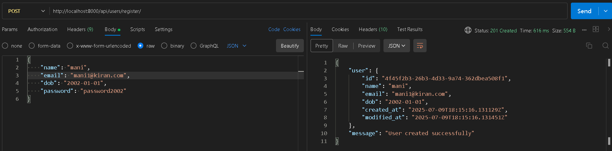
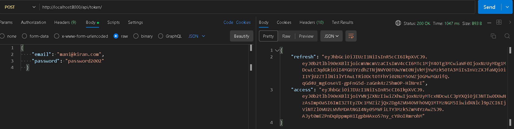
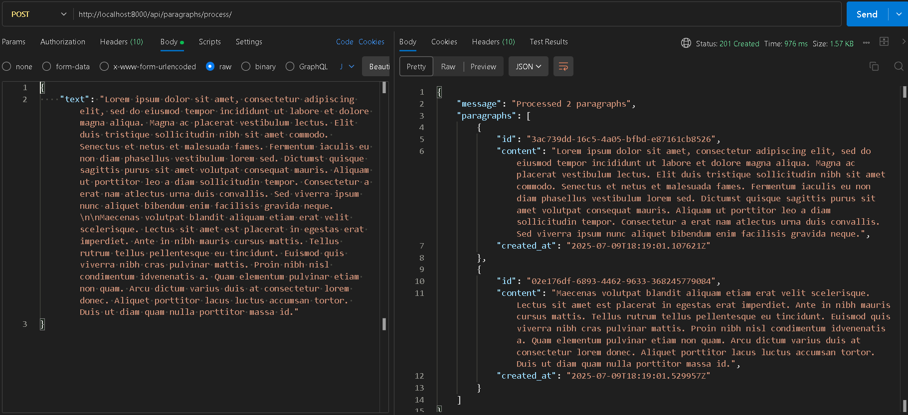
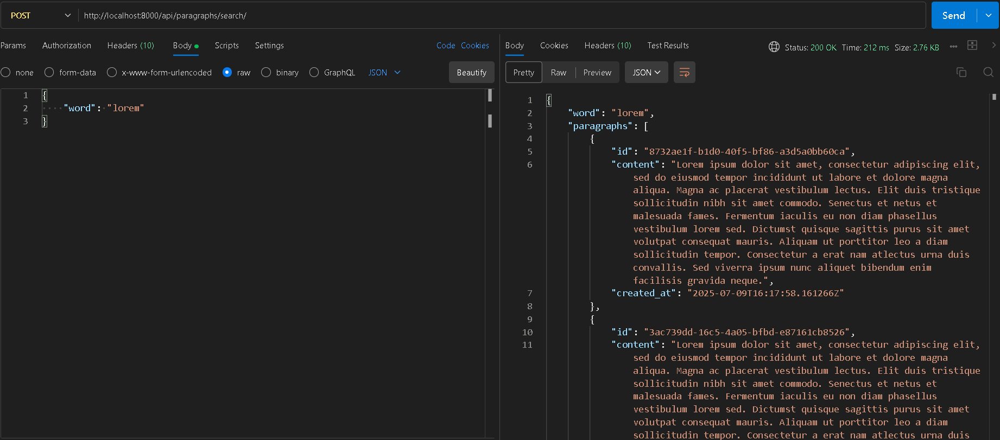

# Paragraph Search API

A REST API built with Django Rest Framework that takes in multiple paragraphs of text as input, stores each paragraph and the words to paragraph mappings on a postgreSQL database.

## Features

- Custom user authentication with JWT
- Text processing with paragraph extraction and word indexing
- Word search functionality that returns top 10 paragraphs containing a word
- PostgreSQL database integration
- Swagger API documentation
- Docker support

## Tech Stack

- Django 4.2
- Django REST Framework
- PostgreSQL
- Docker & Docker Compose
- JWT Authentication

## Setup and Installation

### Using Docker (Recommended)

1. Clone the repository:
   ```
   git clone https://github.com/yourusername/paragraph-search-api.git
   cd paragraph-search-api
   ```

2. Create a `.env` file with the following variables:
   ```
   DEBUG=True
   SECRET_KEY=your_secret_key_here
   DB_NAME=paragraph_search_db
   DB_USER=postgres
   DB_PASSWORD=postgres
   DB_HOST=db
   DB_PORT=5432
   ```

3. Build and run the containers:
   ```
   docker-compose up --build
   ```

4. Create a superuser:
   ```
   docker-compose exec web python manage.py createsuperuser
   ```

### Manual Setup

1. Clone the repository:
   ```
   git clone https://github.com/yourusername/paragraph-search-api.git
   cd paragraph-search-api
   ```

2. Create a virtual environment and activate it:
   ```
   python -m venv venv
   source venv/bin/activate  # On Windows: venv\Scripts\activate
   ```

3. Install dependencies:
   ```
   pip install -r requirements.txt
   ```

4. Set up PostgreSQL database and update `.env` file with your database credentials.

5. Run migrations:
   ```
   python manage.py migrate
   ```

6. Create a superuser:
   ```
   python manage.py createsuperuser
   ```

7. Start the development server:
   ```
   python manage.py runserver
   ```

## API Documentation

Once the server is running, you can access the API documentation at:

- Swagger UI: http://localhost:8000/swagger/
- ReDoc: http://localhost:8000/redoc/

## API Endpoints

### Authentication

- `POST /api/users/register/` - Register a new user
- `POST /api/token/` - Obtain JWT token
- `POST /api/token/refresh/` - Refresh JWT token

### Paragraphs

- `POST /api/paragraphs/process/` - Process and store paragraphs
- `POST /api/paragraphs/search/` - Search for a word in paragraphs

## Usage Examples

### Register a User

```bash
curl -X POST http://localhost:8000/api/users/register/ \
  -H "Content-Type: application/json" \
  -d '{
    "name": "John Doe",
    "email": "john@example.com",
    "dob": "1990-01-01",
    "password": "secure_password123"
  }'
```

### Obtain Token

```bash
curl -X POST http://localhost:8000/api/token/ \
  -H "Content-Type: application/json" \
  -d '{
    "email": "john@example.com",
    "password": "secure_password123"
  }'
```

### Process Paragraphs

```bash
curl -X POST http://localhost:8000/api/paragraphs/process/ \
  -H "Content-Type: application/json" \
  -H "Authorization: Bearer YOUR_ACCESS_TOKEN" \
  -d '{
    "text": "Lorem ipsum dolor sit amet...\n\nSecond paragraph here..."
  }'
```

### Search for a Word

```bash
curl -X POST http://localhost:8000/api/paragraphs/search/ \
  -H "Content-Type: application/json" \
  -H "Authorization: Bearer YOUR_ACCESS_TOKEN" \
  -d '{
    "word": "lorem"
  }'
```

## Postman Usage Image Examples

### Register a User


### Obtain Token


### Process Paragraphs


### Search for a Word
